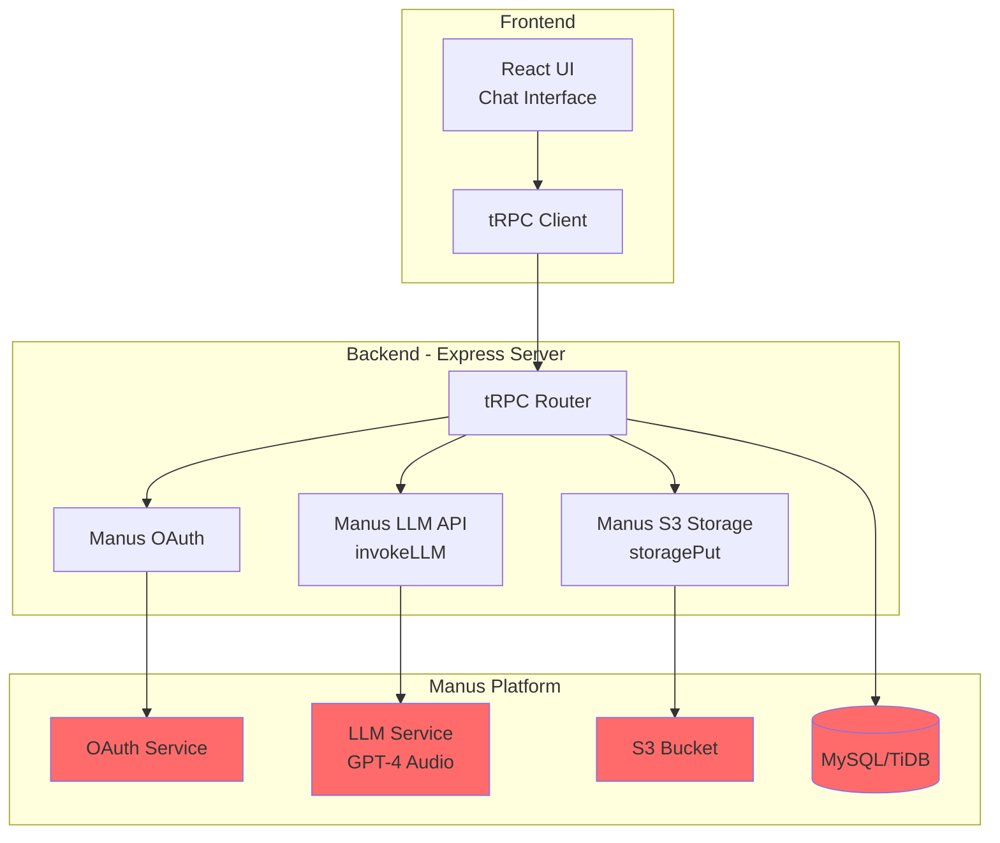
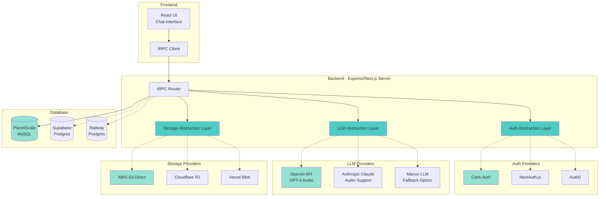

# Producer Copilot - Production Architecture

## Overview

This document outlines the production-ready architecture for Producer Copilot, showing how to migrate from Manus-dependent services to standalone alternatives while maintaining the core functionality.

---

## Current Architecture (Manus-Dependent)



**Dependencies on Manus:**
- 🔴 **Authentication**: Manus OAuth (required for login)
- 🔴 **LLM Processing**: Manus LLM API (required for audio analysis)
- 🔴 **File Storage**: Manus S3 (required for audio uploads)
- 🔴 **Database**: Manus MySQL/TiDB (required for data persistence)

---

## Production Architecture (Standalone with Abstraction)



**Key Changes:**
- ✅ **Abstraction Layers**: Swap providers without changing business logic
- ✅ **Multiple Provider Support**: Choose best option for your needs
- ✅ **No Vendor Lock-in**: Can migrate providers anytime
- ✅ **Cost Optimization**: Compare pricing across providers

---

## Abstraction Layer Design

### 1. LLM Abstraction Layer

**Interface:**
```typescript
// server/services/llm/interface.ts
export interface LLMProvider {
  analyzeAudio(params: {
    audioUrl: string;
    referenceUrl?: string;
    conversationHistory: Message[];
    systemPrompt: string;
  }): Promise<LLMResponse>;
  
  chat(params: {
    messages: Message[];
    systemPrompt: string;
  }): Promise<LLMResponse>;
}

export interface LLMResponse {
  content: string;
  usage?: {
    inputTokens: number;
    outputTokens: number;
    cost: number;
  };
}
```

**Implementations:**
```typescript
// server/services/llm/providers/openai.ts
export class OpenAIProvider implements LLMProvider {
  async analyzeAudio(params) {
    // OpenAI GPT-4 Audio implementation
  }
}

// server/services/llm/providers/manus.ts
export class ManusProvider implements LLMProvider {
  async analyzeAudio(params) {
    // Manus LLM implementation (current)
  }
}

// server/services/llm/providers/anthropic.ts
export class AnthropicProvider implements LLMProvider {
  async analyzeAudio(params) {
    // Anthropic Claude implementation
  }
}
```

**Factory:**
```typescript
// server/services/llm/factory.ts
export function createLLMProvider(): LLMProvider {
  const provider = process.env.LLM_PROVIDER || 'openai';
  
  switch (provider) {
    case 'openai':
      return new OpenAIProvider(process.env.OPENAI_API_KEY);
    case 'manus':
      return new ManusProvider(process.env.MANUS_API_KEY);
    case 'anthropic':
      return new AnthropicProvider(process.env.ANTHROPIC_API_KEY);
    default:
      throw new Error(`Unknown LLM provider: ${provider}`);
  }
}
```

---

### 2. Storage Abstraction Layer

**Interface:**
```typescript
// server/services/storage/interface.ts
export interface StorageProvider {
  upload(params: {
    key: string;
    data: Buffer;
    contentType: string;
  }): Promise<StorageUploadResult>;
  
  getSignedUrl(key: string, expiresIn?: number): Promise<string>;
  
  delete(key: string): Promise<void>;
}

export interface StorageUploadResult {
  key: string;
  url: string;
  size: number;
}
```

**Implementations:**
```typescript
// server/services/storage/providers/aws-s3.ts
export class AWSS3Provider implements StorageProvider {
  async upload(params) {
    // AWS S3 SDK implementation
  }
}

// server/services/storage/providers/cloudflare-r2.ts
export class CloudflareR2Provider implements StorageProvider {
  async upload(params) {
    // Cloudflare R2 implementation
  }
}
```

---

### 3. Auth Abstraction Layer

**Interface:**
```typescript
// server/services/auth/interface.ts
export interface AuthProvider {
  verifySession(token: string): Promise<User | null>;
  
  createSession(user: User): Promise<string>;
  
  revokeSession(token: string): Promise<void>;
  
  getLoginUrl(redirectUrl: string): string;
}

export interface User {
  id: string;
  email: string;
  name?: string;
  role: 'user' | 'admin';
}
```

**Implementations:**
```typescript
// server/services/auth/providers/clerk.ts
export class ClerkAuthProvider implements AuthProvider {
  async verifySession(token) {
    // Clerk SDK implementation
  }
}

// server/services/auth/providers/nextauth.ts
export class NextAuthProvider implements AuthProvider {
  async verifySession(token) {
    // NextAuth.js implementation
  }
}
```

---

## Migration Path

### Phase 1: Add Abstraction Layers (Week 1)
1. Create interface definitions for LLM, Storage, Auth
2. Wrap existing Manus implementations in abstraction layer
3. Update all direct Manus calls to use abstraction layer
4. **No functionality changes** - just refactoring

### Phase 2: Add Alternative Providers (Week 2)
1. Implement OpenAI LLM provider
2. Implement AWS S3 storage provider
3. Implement Clerk auth provider
4. Test each provider independently

### Phase 3: Database Migration (Week 3)
1. Export schema from Manus MySQL
2. Set up PlanetScale/Supabase
3. Run migrations
4. Test with new database
5. Migrate data (if needed)

### Phase 4: Switch to Production Providers (Week 4)
1. Update environment variables
2. Deploy with new providers
3. Monitor costs and performance
4. Keep Manus as fallback option

---

## Recommended Production Stack

### Option A: Cost-Optimized (Startup)
- **Auth**: Clerk (10,000 MAU free)
- **LLM**: OpenAI GPT-4 Audio (~$1-2/analysis)
- **Storage**: Cloudflare R2 ($0.015/GB, no egress fees)
- **Database**: PlanetScale (10GB free)
- **Hosting**: Vercel (free for hobby)

**Monthly Cost (100 users, 500 analyses):**
- Clerk: Free
- OpenAI: $500-1000
- Cloudflare R2: ~$5
- PlanetScale: Free
- Vercel: Free
- **Total: ~$505-1005/month**

### Option B: Enterprise-Ready
- **Auth**: Auth0 (Enterprise features)
- **LLM**: OpenAI GPT-4 Audio + Manus fallback
- **Storage**: AWS S3 (reliability)
- **Database**: PlanetScale (Scaler plan)
- **Hosting**: Railway/Render

**Monthly Cost (1000 users, 5000 analyses):**
- Auth0: $240
- OpenAI: $5000-10000
- AWS S3: ~$50
- PlanetScale: $39
- Railway: $20
- **Total: ~$5349-10349/month**

---

## Cost Comparison: Manus vs Standalone

### Current (Manus)
- **Per Analysis**: $0.85 (70-130 credits)
- **500 analyses/month**: $425
- **5000 analyses/month**: $4,250

### Standalone (OpenAI)
- **Per Analysis**: $1-2 (GPT-4 Audio)
- **500 analyses/month**: $500-1000
- **5000 analyses/month**: $5,000-10,000

**Verdict**: Manus is slightly cheaper for LLM, but standalone gives you:
- Full control over infrastructure
- No vendor lock-in
- Ability to optimize costs
- Direct relationship with OpenAI/Anthropic

---

## Implementation Checklist

### Pre-Migration
- [ ] Document all Manus API calls
- [ ] Create abstraction layer interfaces
- [ ] Wrap existing Manus code in abstraction
- [ ] Add feature flags for provider switching
- [ ] Set up monitoring and logging

### LLM Migration
- [ ] Implement OpenAI provider
- [ ] Test audio analysis quality (compare to Manus)
- [ ] Implement cost tracking
- [ ] Add rate limiting
- [ ] Set up error handling and retries

### Storage Migration
- [ ] Set up AWS S3 bucket
- [ ] Implement S3 provider
- [ ] Test file upload/download
- [ ] Migrate existing files (if needed)
- [ ] Update CORS and security policies

### Auth Migration
- [ ] Set up Clerk project
- [ ] Implement Clerk provider
- [ ] Migrate user data
- [ ] Test login/logout flow
- [ ] Update frontend auth UI

### Database Migration
- [ ] Export Manus database schema
- [ ] Set up PlanetScale database
- [ ] Run migrations
- [ ] Test all queries
- [ ] Migrate production data

### Deployment
- [ ] Update environment variables
- [ ] Deploy to staging
- [ ] Run integration tests
- [ ] Monitor performance and costs
- [ ] Deploy to production
- [ ] Keep Manus as fallback for 30 days

---

## Next Steps

1. **Review this architecture** - Does it meet your needs?
2. **Choose your production stack** - Cost-optimized or enterprise?
3. **Prioritize features** - What to build before migration?
4. **Create migration timeline** - When do you want to launch?

Let me know what you'd like to tackle first!
