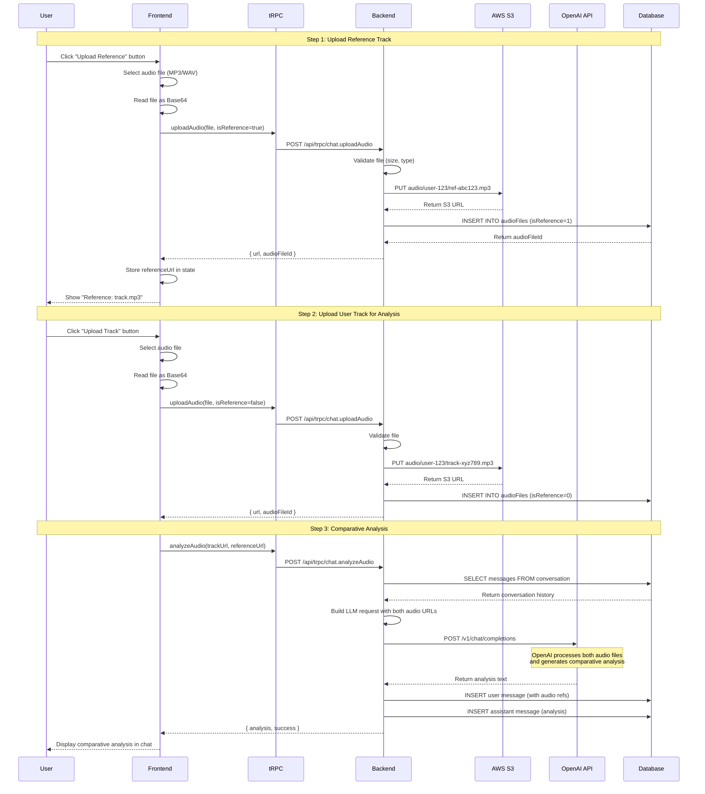

# Reference Track Comparison - Data Flow Documentation

## Overview

This document details the complete data flow for the reference track comparison feature using the production architecture with AWS S3 and OpenAI API.

---

## High-Level Flow



---

## Detailed Component Breakdown

### 1. Reference Track Upload Flow

#### Frontend (React)

**File:** `client/src/pages/Home.tsx`

```typescript
const handleReferenceUpload = async (event: React.ChangeEvent<HTMLInputElement>) => {
  const file = event.target.files?.[0];
  if (!file || !selectedConversationId) return;

  // Validation
  if (file.size > 50 * 1024 * 1024) {
    toast.error("File size must be less than 50MB");
    return;
  }

  if (!file.type.startsWith('audio/')) {
    toast.error("Please upload an audio file");
    return;
  }

  try {
    // Convert to Base64
    const reader = new FileReader();
    reader.onload = async (e) => {
      const base64Data = e.target?.result as string;
      const base64Content = base64Data.split(',')[1];

      // Upload via tRPC
      const uploadResult = await uploadAudio.mutateAsync({
        fileName: file.name,
        fileSize: file.size,
        mimeType: file.type,
        fileData: base64Content,
        conversationId: selectedConversationId,
        isReference: true, // Mark as reference track
      });

      // Store in component state
      setReferenceTrackUrl(uploadResult.url);
      setReferenceFileName(file.name);
      toast.success(`Reference track "${file.name}" uploaded`);
    };
    reader.readAsDataURL(file);
  } catch (error) {
    console.error('Reference upload error:', error);
    toast.error("Failed to upload reference track");
  }
};
```

**State Management:**
```typescript
const [referenceTrackUrl, setReferenceTrackUrl] = useState<string | null>(null);
const [referenceFileName, setReferenceFileName] = useState<string | null>(null);
```

**UI Components:**
```tsx
{/* Reference track indicator */}
{referenceTrackUrl && (
  <div className="mb-3 p-3 bg-accent/20 rounded-lg flex items-center justify-between">
    <div className="flex items-center gap-2">
      <Music className="h-4 w-4" />
      <span>Reference: {referenceFileName}</span>
    </div>
    <Button onClick={handleRemoveReference}>Remove</Button>
  </div>
)}

{/* Upload buttons */}
<Button onClick={() => fileInputRef.current?.click()}>
  <Music /> {/* User track */}
</Button>
<Button onClick={() => referenceInputRef.current?.click()}>
  <Upload /> {/* Reference track */}
  {referenceTrackUrl && <span className="badge" />}
</Button>
```

---

#### Backend - Upload Handler

**File:** `server/routers.ts`

```typescript
uploadAudio: protectedProcedure
  .input(z.object({
    fileName: z.string(),
    fileSize: z.number(),
    mimeType: z.string(),
    fileData: z.string(), // base64 encoded
    conversationId: z.number().optional(),
    isReference: z.boolean().optional(), // NEW: Flag for reference tracks
  }))
  .mutation(async ({ ctx, input }) => {
    // Validate file size (max 50MB)
    if (input.fileSize > 50 * 1024 * 1024) {
      throw new TRPCError({ 
        code: 'BAD_REQUEST', 
        message: 'File size exceeds 50MB limit' 
      });
    }

    // Validate audio file type
    const validTypes = [
      'audio/mpeg', 'audio/wav', 'audio/mp3', 
      'audio/x-wav', 'audio/wave', 'audio/x-m4a', 'audio/mp4'
    ];
    if (!validTypes.includes(input.mimeType)) {
      throw new TRPCError({ 
        code: 'BAD_REQUEST', 
        message: 'Invalid audio file type' 
      });
    }

    // Decode base64 and prepare for upload
    const buffer = Buffer.from(input.fileData, 'base64');
    const fileExt = input.fileName.split('.').pop() || 'mp3';
    
    // Generate unique S3 key
    const prefix = input.isReference ? 'reference' : 'track';
    const s3Key = `audio/${ctx.user.id}/${prefix}-${Date.now()}-${randomId()}.${fileExt}`;
    
    // Upload to AWS S3 (via abstraction layer)
    const { url } = await storageProvider.upload({
      key: s3Key,
      data: buffer,
      contentType: input.mimeType,
    });

    // Save metadata to database
    const audioFileId = await createAudioFile({
      userId: ctx.user.id,
      conversationId: input.conversationId,
      fileName: input.fileName,
      fileSize: input.fileSize,
      mimeType: input.mimeType,
      s3Key,
      s3Url: url,
      isReference: input.isReference ? 1 : 0, // Store as integer flag
    });

    return {
      audioFileId,
      url,
      success: true,
    };
  }),
```

---

#### Storage Layer - AWS S3

**File:** `server/services/storage/providers/aws-s3.ts`

```typescript
import { S3Client, PutObjectCommand } from "@aws-sdk/client-s3";
import { StorageProvider, StorageUploadResult } from "../interface";

export class AWSS3Provider implements StorageProvider {
  private client: S3Client;
  private bucket: string;
  private region: string;

  constructor(config: {
    accessKeyId: string;
    secretAccessKey: string;
    bucket: string;
    region: string;
  }) {
    this.client = new S3Client({
      region: config.region,
      credentials: {
        accessKeyId: config.accessKeyId,
        secretAccessKey: config.secretAccessKey,
      },
    });
    this.bucket = config.bucket;
    this.region = config.region;
  }

  async upload(params: {
    key: string;
    data: Buffer;
    contentType: string;
  }): Promise<StorageUploadResult> {
    const command = new PutObjectCommand({
      Bucket: this.bucket,
      Key: params.key,
      Body: params.data,
      ContentType: params.contentType,
      ACL: 'public-read', // Or use signed URLs for private access
    });

    await this.client.send(command);

    // Generate public URL
    const url = `https://${this.bucket}.s3.${this.region}.amazonaws.com/${params.key}`;

    return {
      key: params.key,
      url,
      size: params.data.length,
    };
  }

  async getSignedUrl(key: string, expiresIn: number = 3600): Promise<string> {
    // Implementation for pre-signed URLs
    const { getSignedUrl } = await import("@aws-sdk/s3-request-presigner");
    const { GetObjectCommand } = await import("@aws-sdk/client-s3");
    
    const command = new GetObjectCommand({
      Bucket: this.bucket,
      Key: key,
    });

    return getSignedUrl(this.client, command, { expiresIn });
  }

  async delete(key: string): Promise<void> {
    const { DeleteObjectCommand } = await import("@aws-sdk/client-s3");
    const command = new DeleteObjectCommand({
      Bucket: this.bucket,
      Key: key,
    });

    await this.client.send(command);
  }
}
```

**Environment Variables:**
```env
AWS_ACCESS_KEY_ID=AKIA...
AWS_SECRET_ACCESS_KEY=...
AWS_S3_BUCKET=producer-copilot-audio
AWS_REGION=us-east-1
```

---

### 2. Comparative Analysis Flow

#### Backend - Analysis Handler

**File:** `server/routers.ts`

```typescript
analyzeAudio: protectedProcedure
  .input(z.object({
    audioUrl: z.string(),
    conversationId: z.number(),
    userPrompt: z.string().optional(),
    referenceUrl: z.string().optional(), // NEW: Optional reference track URL
  }))
  .mutation(async ({ ctx, input }) => {
    // Get conversation history for context
    const history = await getConversationMessages(input.conversationId);
    
    // Build analysis prompt based on whether reference is provided
    const analysisPrompt = input.referenceUrl 
      ? (input.userPrompt || 
         "Compare my track to the reference track. Analyze the differences in " +
         "production quality, mix balance, frequency spectrum, dynamics, and " +
         "provide specific recommendations to make my track sound more like the reference.")
      : (input.userPrompt || 
         "Analyze this audio track and provide detailed feedback on production " +
         "quality, mix balance, frequency spectrum, dynamics, and any areas for improvement.");

    // Build LLM request using abstraction layer
    const llmProvider = createLLMProvider();
    
    const analysisResult = await llmProvider.analyzeAudio({
      audioUrl: input.audioUrl,
      referenceUrl: input.referenceUrl,
      conversationHistory: history.slice(-5), // Last 5 messages for context
      systemPrompt: `You are an expert music production assistant specializing in audio analysis, 
mixing, and mastering. When analyzing audio files, provide detailed, actionable feedback on:

- Overall production quality and mix balance
- Frequency spectrum analysis (bass, mids, highs)
- Dynamic range and loudness
- Stereo imaging and spatial characteristics
- Specific issues and how to fix them
- Genre-appropriate recommendations

${input.referenceUrl ? 
  'When comparing to a reference track, focus on specific differences and provide ' +
  'concrete steps to achieve a similar sound (EQ settings, compression ratios, effects, etc.).' 
  : ''}

Be specific with technical advice (EQ frequencies, compression ratios, etc.) and explain 
the reasoning behind your suggestions.`,
      userPrompt: analysisPrompt,
    });

    // Save conversation messages
    await createMessage({
      conversationId: input.conversationId,
      role: 'user',
      content: input.referenceUrl 
        ? `${analysisPrompt}\n[Audio file uploaded]\n[Reference track uploaded]`
        : `${analysisPrompt}\n[Audio file uploaded]`,
    });

    await createMessage({
      conversationId: input.conversationId,
      role: 'assistant',
      content: analysisResult.content,
    });

    // Update conversation timestamp
    await updateConversationTimestamp(input.conversationId);

    return {
      analysis: analysisResult.content,
      usage: analysisResult.usage, // Cost tracking
      success: true,
    };
  }),
```

---

#### LLM Layer - OpenAI Implementation

**File:** `server/services/llm/providers/openai.ts`

```typescript
import OpenAI from "openai";
import { LLMProvider, LLMResponse, Message } from "../interface";

export class OpenAIProvider implements LLMProvider {
  private client: OpenAI;

  constructor(apiKey: string) {
    this.client = new OpenAI({ apiKey });
  }

  async analyzeAudio(params: {
    audioUrl: string;
    referenceUrl?: string;
    conversationHistory: Message[];
    systemPrompt: string;
    userPrompt?: string;
  }): Promise<LLMResponse> {
    // Build messages array for OpenAI API
    const messages: OpenAI.Chat.ChatCompletionMessageParam[] = [
      {
        role: 'system',
        content: params.systemPrompt,
      },
      // Add conversation history
      ...params.conversationHistory.map(msg => ({
        role: msg.role as 'user' | 'assistant',
        content: msg.content,
      })),
      // Add audio analysis request
      {
        role: 'user',
        content: params.referenceUrl ? [
          // Comparative analysis with reference track
          { type: 'text' as const, text: params.userPrompt || "Compare these tracks" },
          { type: 'text' as const, text: "\n\nMy Track:" },
          { 
            type: 'input_audio' as const, 
            input_audio: { 
              data: params.audioUrl,
              format: 'mp3'
            } 
          },
          { type: 'text' as const, text: "\n\nReference Track:" },
          { 
            type: 'input_audio' as const, 
            input_audio: { 
              data: params.referenceUrl,
              format: 'mp3'
            } 
          },
        ] : [
          // Single track analysis
          { type: 'text' as const, text: params.userPrompt || "Analyze this track" },
          { 
            type: 'input_audio' as const, 
            input_audio: { 
              data: params.audioUrl,
              format: 'mp3'
            } 
          },
        ],
      },
    ];

    // Call OpenAI API
    const completion = await this.client.chat.completions.create({
      model: 'gpt-4-audio-preview', // Or latest audio model
      messages,
      temperature: 0.7,
      max_tokens: 2000,
    });

    const responseContent = completion.choices[0]?.message?.content || 
      "I'm sorry, I couldn't analyze the audio file.";

    // Calculate cost (approximate)
    const usage = completion.usage;
    const inputCost = (usage?.prompt_tokens || 0) * 0.00001; // $0.01 per 1K tokens
    const outputCost = (usage?.completion_tokens || 0) * 0.00003; // $0.03 per 1K tokens
    const totalCost = inputCost + outputCost;

    return {
      content: responseContent,
      usage: {
        inputTokens: usage?.prompt_tokens || 0,
        outputTokens: usage?.completion_tokens || 0,
        cost: totalCost,
      },
    };
  }

  async chat(params: {
    messages: Message[];
    systemPrompt: string;
  }): Promise<LLMResponse> {
    // Standard chat implementation (no audio)
    const messages: OpenAI.Chat.ChatCompletionMessageParam[] = [
      { role: 'system', content: params.systemPrompt },
      ...params.messages.map(msg => ({
        role: msg.role as 'user' | 'assistant',
        content: msg.content,
      })),
    ];

    const completion = await this.client.chat.completions.create({
      model: 'gpt-4-turbo-preview',
      messages,
      temperature: 0.7,
      max_tokens: 1500,
    });

    const responseContent = completion.choices[0]?.message?.content || 
      "I'm sorry, I couldn't generate a response.";

    const usage = completion.usage;
    const inputCost = (usage?.prompt_tokens || 0) * 0.00001;
    const outputCost = (usage?.completion_tokens || 0) * 0.00003;

    return {
      content: responseContent,
      usage: {
        inputTokens: usage?.prompt_tokens || 0,
        outputTokens: usage?.completion_tokens || 0,
        cost: inputCost + outputCost,
      },
    };
  }
}
```

**Environment Variables:**
```env
OPENAI_API_KEY=sk-...
LLM_PROVIDER=openai
```

---

### 3. Database Schema

**File:** `drizzle/schema.ts`

```typescript
export const audioFiles = mysqlTable("audioFiles", {
  id: int("id").autoincrement().primaryKey(),
  userId: int("userId").notNull(),
  conversationId: int("conversationId"),
  messageId: int("messageId"),
  fileName: varchar("fileName", { length: 255 }).notNull(),
  fileSize: int("fileSize").notNull(),
  mimeType: varchar("mimeType", { length: 100 }).notNull(),
  s3Key: varchar("s3Key", { length: 500 }).notNull(),
  s3Url: varchar("s3Url", { length: 1000 }).notNull(),
  isReference: int("isReference").default(0).notNull(), // 0 = user track, 1 = reference track
  createdAt: timestamp("createdAt").defaultNow().notNull(),
});
```

**Queries:**

```typescript
// Get all reference tracks for a user
export async function getUserReferenceT--snip--acks(userId: number) {
  const db = await getDb();
  if (!db) return [];
  
  return db.select()
    .from(audioFiles)
    .where(and(
      eq(audioFiles.userId, userId),
      eq(audioFiles.isReference, 1)
    ))
    .orderBy(desc(audioFiles.createdAt));
}

// Get user tracks (non-reference)
export async function getUserTracks(userId: number) {
  const db = await getDb();
  if (!db) return [];
  
  return db.select()
    .from(audioFiles)
    .where(and(
      eq(audioFiles.userId, userId),
      eq(audioFiles.isReference, 0)
    ))
    .orderBy(desc(audioFiles.createdAt));
}
```

---

## Data Flow Summary

### Upload Reference Track
1. **User** selects audio file via UI
2. **Frontend** reads file as Base64
3. **tRPC** sends to backend with `isReference: true`
4. **Backend** validates file (size, type)
5. **AWS S3** stores file, returns public URL
6. **Database** saves metadata with `isReference=1`
7. **Frontend** stores URL in state, shows indicator

### Upload User Track + Analyze
1. **User** selects track to analyze
2. **Frontend** reads file as Base64
3. **tRPC** sends to backend with `isReference: false`
4. **Backend** validates and uploads to AWS S3
5. **Database** saves metadata with `isReference=0`
6. **Backend** retrieves conversation history
7. **Backend** builds LLM request with:
   - System prompt (expert music production assistant)
   - Conversation history (last 5 messages)
   - User track URL
   - Reference track URL (if available)
   - Comparative analysis prompt
8. **OpenAI API** processes both audio files
9. **OpenAI API** returns detailed comparative analysis
10. **Database** saves user message and AI response
11. **Frontend** displays analysis in chat

---

## Cost Tracking

### Per-Request Cost Calculation

```typescript
interface UsageMetrics {
  inputTokens: number;
  outputTokens: number;
  cost: number;
  timestamp: Date;
  userId: number;
  conversationId: number;
}

// Save usage metrics for billing
async function trackUsage(metrics: UsageMetrics) {
  const db = await getDb();
  await db.insert(usageMetrics).values(metrics);
}

// Calculate monthly cost per user
async function getUserMonthlyCost(userId: number, month: Date) {
  const db = await getDb();
  const result = await db.select({
    totalCost: sql`SUM(cost)`,
    analysisCount: sql`COUNT(*)`,
  })
  .from(usageMetrics)
  .where(and(
    eq(usageMetrics.userId, userId),
    gte(usageMetrics.timestamp, month),
  ));
  
  return result[0];
}
```

---

## Error Handling

### File Upload Errors

```typescript
// File too large
if (fileSize > 50 * 1024 * 1024) {
  throw new TRPCError({
    code: 'BAD_REQUEST',
    message: 'File size exceeds 50MB limit',
  });
}

// Invalid file type
if (!validTypes.includes(mimeType)) {
  throw new TRPCError({
    code: 'BAD_REQUEST',
    message: 'Invalid audio file type. Supported: MP3, WAV, M4A',
  });
}

// S3 upload failure
try {
  await storageProvider.upload({ key, data, contentType });
} catch (error) {
  throw new TRPCError({
    code: 'INTERNAL_SERVER_ERROR',
    message: 'Failed to upload file to storage',
    cause: error,
  });
}
```

### LLM API Errors

```typescript
try {
  const result = await llmProvider.analyzeAudio(params);
} catch (error) {
  if (error.code === 'insufficient_quota') {
    throw new TRPCError({
      code: 'INTERNAL_SERVER_ERROR',
      message: 'AI service quota exceeded. Please try again later.',
    });
  }
  
  if (error.code === 'invalid_request_error') {
    throw new TRPCError({
      code: 'BAD_REQUEST',
      message: 'Audio file format not supported by AI service',
    });
  }
  
  throw new TRPCError({
    code: 'INTERNAL_SERVER_ERROR',
    message: 'Failed to analyze audio',
    cause: error,
  });
}
```

---

## Security Considerations

### 1. File Validation
- **Size limit**: 50MB max
- **Type whitelist**: Only audio/* MIME types
- **Magic number check**: Verify actual file format (not just extension)
- **Virus scanning**: Integrate ClamAV or similar

### 2. S3 Security
- **Private bucket**: Use pre-signed URLs instead of public access
- **CORS policy**: Restrict to your domain
- **Lifecycle rules**: Auto-delete files after 90 days
- **Encryption**: Enable S3 server-side encryption

### 3. Rate Limiting
- **Per user**: 10 uploads per hour
- **Per IP**: 20 uploads per hour
- **Global**: 1000 uploads per hour

### 4. Cost Protection
- **Usage quotas**: Enforce tier limits (1 free, 10 pro)
- **Cost alerts**: Notify when user exceeds expected cost
- **Circuit breaker**: Pause service if daily cost > $1000

---

## Performance Optimization

### 1. Client-Side Compression
```typescript
// Compress audio before upload (reduce file size by 30-50%)
import { compressAudio } from '@/lib/audio-compression';

const compressedFile = await compressAudio(originalFile, {
  bitrate: 128, // kbps
  format: 'mp3',
});
```

### 2. Parallel Uploads
```typescript
// Upload user track and reference track in parallel
const [userUpload, refUpload] = await Promise.all([
  uploadAudio({ file: userTrack, isReference: false }),
  uploadAudio({ file: referenceTrack, isReference: true }),
]);
```

### 3. Caching
```typescript
// Cache reference track analysis for reuse
const cacheKey = `analysis:${referenceTrackUrl}`;
const cached = await redis.get(cacheKey);

if (cached) {
  return JSON.parse(cached);
}

const analysis = await llmProvider.analyzeAudio(params);
await redis.setex(cacheKey, 3600, JSON.stringify(analysis)); // 1 hour TTL
```

---

## Testing Strategy

### Unit Tests
```typescript
describe('Reference Track Upload', () => {
  it('should upload reference track to S3', async () => {
    const result = await uploadAudio({
      fileName: 'reference.mp3',
      fileSize: 5000000,
      mimeType: 'audio/mpeg',
      fileData: base64Data,
      isReference: true,
    });
    
    expect(result.url).toContain('s3.amazonaws.com');
    expect(result.audioFileId).toBeGreaterThan(0);
  });
  
  it('should reject files over 50MB', async () => {
    await expect(uploadAudio({
      fileSize: 60 * 1024 * 1024,
      isReference: true,
    })).rejects.toThrow('File size exceeds 50MB limit');
  });
});
```

### Integration Tests
```typescript
describe('Comparative Analysis', () => {
  it('should analyze user track against reference', async () => {
    // Upload reference
    const ref = await uploadAudio({ file: referenceFile, isReference: true });
    
    // Upload user track
    const user = await uploadAudio({ file: userFile, isReference: false });
    
    // Analyze
    const analysis = await analyzeAudio({
      audioUrl: user.url,
      referenceUrl: ref.url,
      conversationId: 1,
    });
    
    expect(analysis.content).toContain('compared to the reference');
    expect(analysis.usage.cost).toBeGreaterThan(0);
  });
});
```

---

## Monitoring & Observability

### Key Metrics
- **Upload success rate**: % of successful uploads
- **Average upload time**: Time from client to S3
- **Analysis latency**: Time for OpenAI to process
- **Cost per analysis**: Track actual vs expected cost
- **Error rate**: % of failed requests

### Logging
```typescript
logger.info('Reference track uploaded', {
  userId,
  fileName,
  fileSize,
  s3Key,
  duration: Date.now() - startTime,
});

logger.info('Comparative analysis completed', {
  userId,
  conversationId,
  hasReference: !!referenceUrl,
  inputTokens: usage.inputTokens,
  outputTokens: usage.outputTokens,
  cost: usage.cost,
  duration: Date.now() - startTime,
});
```

---

## Next Steps

1. **Implement abstraction layers** - Start with LLM layer
2. **Set up AWS S3** - Create bucket and configure access
3. **Integrate OpenAI API** - Test audio analysis
4. **Add cost tracking** - Monitor per-user usage
5. **Implement rate limiting** - Protect against abuse
6. **Add usage quotas** - Enforce tier limits

Ready to start implementing?
