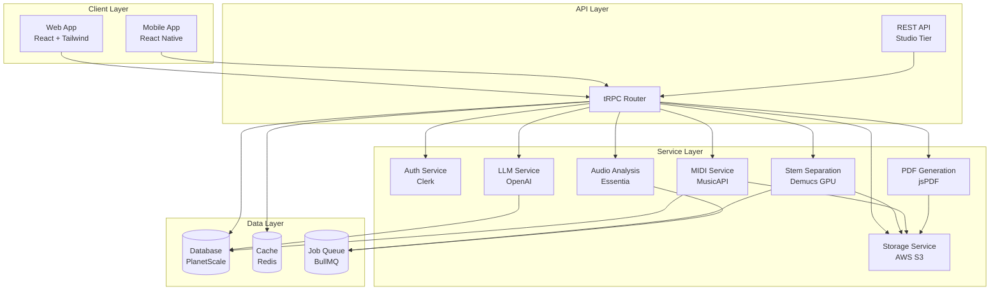
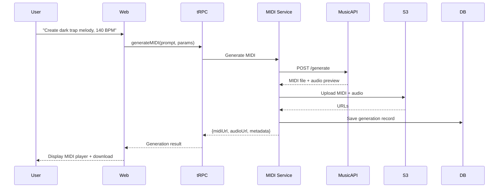
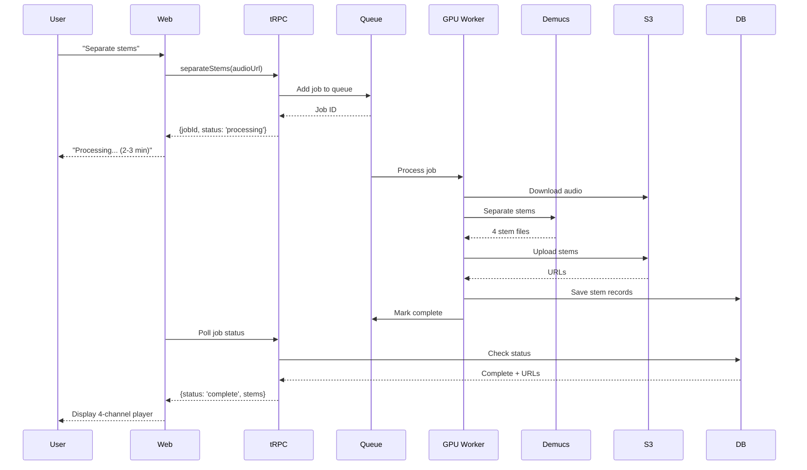

# Producer Copilot V2 - Comprehensive Playbook

## Executive Summary

Producer Copilot V2 transforms from a simple audio analysis tool into a **complete AI-powered music production assistant platform**. V2 adds generative capabilities (MIDI/audio), advanced analysis features (stem separation, batch processing), collaboration tools, and deeper workflow integration.

**V1 → V2 Evolution:**
- V1: Conversational AI + Audio Analysis + Reference Comparison
- V2: **V1 + MIDI Generation + Stem Separation + Batch Processing + Team Collaboration + Project Management**

**Target Launch:** Q2 2026 (6 months after V1 launch)

---

## Table of Contents

1. [Vision & Strategy](#vision--strategy)
2. [Feature Specifications](#feature-specifications)
3. [Technical Architecture](#technical-architecture)
4. [Implementation Roadmap](#implementation-roadmap)
5. [Resource Requirements](#resource-requirements)
6. [Pricing & Monetization](#pricing--monetization)
7. [Go-to-Market Strategy](#go-to-market-strategy)
8. [Success Metrics](#success-metrics)

---

## Vision & Strategy

### Product Vision

**"The AI co-producer that listens, learns, and creates with you - from first idea to final master."**

Producer Copilot V2 becomes the **central hub** for music production workflow:
1. **Ideation**: Generate MIDI patterns and melodies from text descriptions
2. **Production**: Get real-time feedback on your tracks
3. **Analysis**: Deep-dive into frequency spectrum, dynamics, stereo imaging
4. **Comparison**: Learn from professional reference tracks
5. **Iteration**: Quickly test variations and improvements
6. **Collaboration**: Work with team members and share insights
7. **Organization**: Manage multiple projects and track progress

### Strategic Goals

1. **Expand TAM (Total Addressable Market)**
   - V1: Bedroom producers seeking feedback ($50M market)
   - V2: All music creators from ideation to mastering ($500M+ market)

2. **Increase Engagement**
   - V1: 1-2 sessions per week (analysis only)
   - V2: Daily usage (ideation, analysis, iteration)

3. **Improve Retention**
   - V1: 40% monthly churn (analysis is episodic)
   - V2: 15% monthly churn (integrated into daily workflow)

4. **Build Moat**
   - V1: Easily replicable (just LLM + audio analysis)
   - V2: Network effects (project history, learned preferences, team collaboration)

### Competitive Positioning

| Feature | Producer Copilot V2 | LANDR | iZotope | Splice | Soundtrap |
|---------|---------------------|-------|---------|--------|-----------|
| AI Audio Analysis | ✅ Conversational | ❌ | ❌ | ❌ | ❌ |
| Reference Comparison | ✅ | ❌ | ❌ | ❌ | ❌ |
| MIDI Generation | ✅ | ❌ | ❌ | ❌ | ✅ Limited |
| Stem Separation | ✅ | ❌ | ✅ Plugin | ❌ | ❌ |
| Batch Processing | ✅ | ✅ | ❌ | ❌ | ❌ |
| Team Collaboration | ✅ | ❌ | ❌ | ✅ | ✅ |
| Project Management | ✅ | ❌ | ❌ | ✅ | ✅ |
| Educational Focus | ✅ | ❌ | ❌ | ❌ | ❌ |
| **Price** | **$19-49/mo** | $12.99/mo | $55-499 | $9.99/mo | $14.99/mo |

**Our Unique Value:** The only platform that combines **conversational AI + analysis + generation + education** in one integrated workflow.

---

## Feature Specifications

### 1. AI MIDI Generation 🎹

**Problem:** Producers face writer's block and need inspiration for melodies, chord progressions, and rhythms.

**Solution:** Generate MIDI patterns from natural language descriptions.

#### Features

**1.1 Text-to-MIDI Generation**
```
User: "Create a dark, minor key melody for trap music, 140 BPM"
AI: [Generates MIDI file with melody]
```

- **Inputs:**
  - Text description (genre, mood, key, tempo, instruments)
  - Optional: Existing MIDI to extend/continue
  - Optional: Reference audio to match style

- **Outputs:**
  - MIDI file (downloadable)
  - Audio preview (rendered with built-in synths)
  - Editable in browser MIDI editor

- **Parameters:**
  - Genre (Hip-Hop, EDM, Rock, Jazz, Classical, etc.)
  - Mood (Dark, Uplifting, Melancholic, Energetic, etc.)
  - Key (C Major, A Minor, etc.)
  - Tempo (60-200 BPM)
  - Complexity (Simple, Medium, Complex)
  - Instruments (Piano, Synth, Bass, Drums, etc.)

**1.2 MIDI Continuation**
```
User: [Uploads 4-bar MIDI pattern]
User: "Continue this melody for 8 more bars"
AI: [Extends the pattern maintaining style and key]
```

**1.3 Chord Progression Generator**
```
User: "Give me a chord progression for an emotional pop ballad"
AI: "I suggest: Am - F - C - G (i - VI - III - VII in A minor)
     This progression creates tension and release, commonly used in emotional pop.
     [MIDI file attached]"
```

**1.4 Drum Pattern Generator**
```
User: "Create a boom-bap drum pattern, 90 BPM"
AI: [Generates kick, snare, hi-hat MIDI pattern]
```

#### Technical Implementation

**API Integration:**
- **Primary**: MusicAPI.ai (Sonic/Nuro models)
- **Fallback**: Google Lyria RealTime
- **Cost**: ~$0.01-0.02 per generation

**Architecture:**
```typescript
// server/services/midi/interface.ts
export interface MIDIProvider {
  generateMIDI(params: {
    prompt: string;
    genre?: string;
    key?: string;
    tempo?: number;
    bars?: number;
    instruments?: string[];
  }): Promise<MIDIGenerationResult>;
  
  continueMIDI(params: {
    existingMIDI: Buffer;
    bars: number;
    prompt?: string;
  }): Promise<MIDIGenerationResult>;
}

export interface MIDIGenerationResult {
  midiFile: Buffer;
  audioPreview: string; // URL to rendered audio
  metadata: {
    key: string;
    tempo: number;
    duration: number;
    instruments: string[];
  };
  cost: number;
}
```

**Database Schema:**
```typescript
export const midiGenerations = mysqlTable("midiGenerations", {
  id: int("id").autoincrement().primaryKey(),
  userId: int("userId").notNull(),
  projectId: int("projectId"),
  prompt: text("prompt").notNull(),
  genre: varchar("genre", { length: 50 }),
  key: varchar("key", { length: 20 }),
  tempo: int("tempo"),
  midiFileUrl: varchar("midiFileUrl", { length: 1000 }).notNull(),
  audioPreviewUrl: varchar("audioPreviewUrl", { length: 1000 }),
  metadata: json("metadata"),
  cost: decimal("cost", { precision: 10, scale: 4 }),
  createdAt: timestamp("createdAt").defaultNow().notNull(),
});
```

**UI Components:**
- MIDI generation panel in chat interface
- Parameter sliders (tempo, complexity, bars)
- Genre/mood dropdown selectors
- MIDI preview player with waveform
- Download button (MIDI + audio)
- "Send to DAW" button (future: VST plugin integration)

#### Usage Limits

| Tier | MIDI Generations/Month | Cost per Extra |
|------|------------------------|----------------|
| Free | 3 | N/A |
| Pro | 50 | $0.50 |
| Studio | Unlimited | Included |

---

### 2. Stem Separation 🎵

**Problem:** Producers want to analyze individual elements (vocals, drums, bass, other) of reference tracks or their own mixes.

**Solution:** AI-powered stem separation to isolate instruments.

#### Features

**2.1 4-Stem Separation**
- **Vocals**: Lead and backing vocals
- **Drums**: Kick, snare, hi-hats, percussion
- **Bass**: Bass guitar, sub-bass, 808s
- **Other**: Everything else (synths, guitars, pads, etc.)

**2.2 Use Cases**
1. **Reference Track Analysis**: "Isolate the drums from this reference track to analyze the pattern"
2. **Mix Troubleshooting**: "Separate my vocals to check if they're too loud"
3. **Learning**: "Show me how the bass sits in this professional mix"
4. **Sampling**: "Extract the drums for creative reuse" (with copyright disclaimer)

**2.3 Workflow Integration**
```
User: [Uploads track]
User: "Separate the stems and analyze the vocal mix"
AI: [Separates stems, analyzes vocal level, EQ, compression]
AI: "Your vocals are 3dB louder than the reference. They're centered but lack stereo width.
     I recommend: 
     - Reduce vocal level by 2-3dB
     - Add stereo widening to backing vocals (Haas effect or stereo delay)
     - Cut 250-350 Hz to reduce boxiness
     
     [4 stem files attached: vocals.wav, drums.wav, bass.wav, other.wav]"
```

#### Technical Implementation

**API Options:**
- **Spleeter** (Deezer, open-source, free but requires hosting)
- **Demucs** (Meta, state-of-the-art, open-source)
- **LALAL.AI API** (commercial, $0.10-0.50 per track)
- **AudioShake API** (commercial, high quality)

**Recommended**: Host Demucs on GPU server (AWS EC2 g4dn.xlarge)
- **Cost**: ~$0.526/hour = $0.05-0.10 per separation (2-3 minutes processing)
- **Quality**: State-of-the-art separation
- **Control**: Full ownership, no API limits

**Architecture:**
```typescript
// server/services/stems/interface.ts
export interface StemSeparationProvider {
  separateStems(params: {
    audioUrl: string;
    outputFormat: 'wav' | 'mp3';
    quality: 'low' | 'medium' | 'high';
  }): Promise<StemSeparationResult>;
}

export interface StemSeparationResult {
  stems: {
    vocals: string; // S3 URL
    drums: string;
    bass: string;
    other: string;
  };
  processingTime: number;
  cost: number;
}
```

**Database Schema:**
```typescript
export const stemSeparations = mysqlTable("stemSeparations", {
  id: int("id").autoincrement().primaryKey(),
  userId: int("userId").notNull(),
  audioFileId: int("audioFileId").notNull(),
  vocalsUrl: varchar("vocalsUrl", { length: 1000 }).notNull(),
  drumsUrl: varchar("drumsUrl", { length: 1000 }).notNull(),
  bassUrl: varchar("bassUrl", { length: 1000 }).notNull(),
  otherUrl: varchar("otherUrl", { length: 1000 }).notNull(),
  processingTime: int("processingTime"), // seconds
  cost: decimal("cost", { precision: 10, scale: 4 }),
  createdAt: timestamp("createdAt").defaultNow().notNull(),
});
```

**UI Components:**
- "Separate Stems" button on audio uploads
- Progress indicator during processing (2-3 minutes)
- 4-channel audio player (solo/mute each stem)
- Waveform visualization for each stem
- Download all stems as ZIP
- Individual stem analysis option

#### Usage Limits

| Tier | Stem Separations/Month | Cost per Extra |
|------|------------------------|----------------|
| Free | 0 | N/A |
| Pro | 5 | $2.00 |
| Studio | 30 | $1.00 |

---

### 3. Batch Audio Analysis 📊

**Problem:** Producers want to analyze multiple tracks at once (album, EP, project folder).

**Solution:** Upload and analyze multiple audio files simultaneously with comparative insights.

#### Features

**3.1 Multi-Track Upload**
- Drag-and-drop multiple files (up to 20 at once)
- Folder upload support
- Progress indicator for each file

**3.2 Batch Analysis Modes**

**Mode A: Individual Analysis**
- Analyze each track separately
- Generate individual reports
- Export as combined PDF

**Mode B: Comparative Analysis**
- Compare all tracks against each other
- Identify consistency issues (loudness, tonal balance, stereo width)
- Highlight outliers

**Mode C: Album Mastering Check**
- Ensure consistent loudness across tracks
- Check for tonal balance consistency
- Verify track order flow

**3.3 Batch Report**
```markdown
# Album Analysis Report

## Overview
- Total Tracks: 12
- Average Loudness: -14 LUFS
- Loudness Range: -16 to -12 LUFS (4 LU spread)
- Consistency Score: 78/100

## Issues Found
1. Track 3 "Midnight Drive" is 3dB quieter than others
2. Track 7 "Summer Nights" has excessive high-end (2dB above average)
3. Track 9 "Broken Dreams" has narrow stereo width compared to others

## Recommendations
- Increase loudness of Track 3 by 2-3dB
- Apply gentle high-shelf cut (-2dB at 8kHz) to Track 7
- Widen stereo image of Track 9 using mid-side processing

[Individual track reports attached]
```

#### Technical Implementation

**Architecture:**
```typescript
// server/routers.ts
batchAnalyzeAudio: protectedProcedure
  .input(z.object({
    audioUrls: z.array(z.string()).min(2).max(20),
    mode: z.enum(['individual', 'comparative', 'album']),
    conversationId: z.number(),
  }))
  .mutation(async ({ ctx, input }) => {
    // Process all tracks in parallel
    const analyses = await Promise.all(
      input.audioUrls.map(url => 
        llmProvider.analyzeAudio({ audioUrl: url, ... })
      )
    );
    
    // Generate comparative insights
    const comparison = await llmProvider.compareMultipleTracks({
      analyses,
      mode: input.mode,
    });
    
    return {
      individualAnalyses: analyses,
      comparison,
      reportUrl: await generatePDFReport(analyses, comparison),
    };
  }),
```

**UI Components:**
- Multi-file upload zone
- Batch analysis mode selector
- Progress dashboard (X of Y complete)
- Comparative visualization (loudness graph, frequency heatmap)
- Export to PDF button
- "Fix Issues" action buttons (future: auto-mastering)

#### Usage Limits

| Tier | Batch Analysis/Month | Max Files per Batch |
|------|----------------------|---------------------|
| Free | 0 | N/A |
| Pro | 3 batches | 10 files |
| Studio | Unlimited | 20 files |

---

### 4. Project Management 📁

**Problem:** Producers work on multiple projects simultaneously and lose track of feedback, versions, and progress.

**Solution:** Organize conversations, tracks, and analyses into projects.

#### Features

**4.1 Project Creation**
```
User: "Create a new project called 'Summer EP 2026'"
AI: "Project created! You can now organize all tracks, analyses, and conversations for this EP here."
```

**4.2 Project Dashboard**
- **Overview**: Track count, analysis count, MIDI generations, total cost
- **Files**: All uploaded audio and MIDI files
- **Conversations**: Chat history related to this project
- **Timeline**: Activity feed (uploads, analyses, generations)
- **Collaborators**: Team members with access (Studio tier)

**4.3 Project Templates**
- **Single Track**: One song from start to finish
- **EP**: 4-6 tracks with consistency checks
- **Album**: 10-15 tracks with mastering workflow
- **Remix**: Original + remix versions with comparison
- **Client Work**: Multiple revisions and feedback rounds

**4.4 Version Control**
- Upload multiple versions of same track
- Compare versions side-by-side
- Track changes over time
- Revert to previous versions

#### Technical Implementation

**Database Schema:**
```typescript
export const projects = mysqlTable("projects", {
  id: int("id").autoincrement().primaryKey(),
  userId: int("userId").notNull(),
  name: varchar("name", { length: 255 }).notNull(),
  description: text("description"),
  template: varchar("template", { length: 50 }),
  coverImage: varchar("coverImage", { length: 1000 }),
  status: mysqlEnum("status", ["active", "archived", "completed"]).default("active"),
  createdAt: timestamp("createdAt").defaultNow().notNull(),
  updatedAt: timestamp("updatedAt").defaultNow().onUpdateNow().notNull(),
});

export const projectMembers = mysqlTable("projectMembers", {
  id: int("id").autoincrement().primaryKey(),
  projectId: int("projectId").notNull(),
  userId: int("userId").notNull(),
  role: mysqlEnum("role", ["owner", "editor", "viewer"]).default("viewer"),
  invitedAt: timestamp("invitedAt").defaultNow().notNull(),
});

export const projectFiles = mysqlTable("projectFiles", {
  id: int("id").autoincrement().primaryKey(),
  projectId: int("projectId").notNull(),
  fileType: mysqlEnum("fileType", ["audio", "midi", "stem", "document"]).notNull(),
  fileId: int("fileId").notNull(), // References audioFiles or midiGenerations
  version: int("version").default(1),
  createdAt: timestamp("createdAt").defaultNow().notNull(),
});
```

**UI Components:**
- Project sidebar (list of all projects)
- Project dashboard page
- File browser with filters (audio, MIDI, stems, documents)
- Timeline/activity feed
- Collaborator management (invite, remove, change role)
- Project settings (rename, archive, delete)

#### Usage Limits

| Tier | Projects | Collaborators | Storage |
|------|----------|---------------|---------|
| Free | 1 | 0 | 500MB |
| Pro | 10 | 0 | 10GB |
| Studio | Unlimited | 5 per project | 100GB |

---

### 5. Advanced Audio Analysis 🔬

**Problem:** V1 audio analysis is good but lacks depth for advanced producers.

**Solution:** Add detailed technical metrics and visualizations.

#### Features

**5.1 Frequency Spectrum Analysis**
- Visual spectrum analyzer (20Hz - 20kHz)
- Identify frequency imbalances
- Compare to reference track spectrum
- Highlight problematic frequencies

**5.2 Loudness Metrics**
- **LUFS**: Integrated, short-term, momentary
- **True Peak**: Peak levels (dBTP)
- **Dynamic Range**: DR meter
- **Crest Factor**: Peak-to-RMS ratio
- **Compliance**: Spotify (-14 LUFS), Apple Music (-16 LUFS), YouTube (-13 LUFS)

**5.3 Stereo Imaging**
- **Stereo Width**: Mono, narrow, wide, ultra-wide
- **Phase Correlation**: Mono compatibility check
- **L/R Balance**: Left-right channel balance
- **Mid/Side Analysis**: Center vs sides content

**5.4 Transient Analysis**
- **Attack Time**: How fast sounds hit
- **Sustain**: How long sounds hold
- **Decay**: How sounds fade out
- **Punch**: Transient energy vs sustained energy

**5.5 Harmonic Analysis**
- **Fundamental Frequency**: Root note detection
- **Harmonics**: Overtone structure
- **THD**: Total harmonic distortion
- **Inharmonicity**: Tuning issues

#### Technical Implementation

**Audio Processing Libraries:**
- **Essentia** (Music Information Retrieval)
- **Librosa** (Python audio analysis)
- **Web Audio API** (Client-side visualization)

**Architecture:**
```typescript
// server/services/audio-analysis/interface.ts
export interface AudioAnalysisProvider {
  analyzeAudio(params: {
    audioUrl: string;
  }): Promise<AudioAnalysisResult>;
}

export interface AudioAnalysisResult {
  loudness: {
    integrated: number; // LUFS
    shortTerm: number[];
    momentary: number[];
    truePeak: number; // dBTP
    dynamicRange: number; // DR
  };
  spectrum: {
    frequencies: number[]; // Hz
    magnitudes: number[]; // dB
    peaks: Array<{ freq: number; mag: number }>;
  };
  stereo: {
    width: number; // 0-1
    phaseCorrelation: number; // -1 to 1
    balance: number; // -1 (left) to 1 (right)
  };
  transients: {
    attackTime: number; // ms
    punchScore: number; // 0-100
  };
  harmonics: {
    fundamental: number; // Hz
    harmonics: number[]; // Hz
    thd: number; // %
  };
}
```

**UI Components:**
- Interactive spectrum analyzer
- Loudness meter with target zones
- Stereo width visualizer (Goniometer)
- Waveform with transient markers
- Harmonic series chart

---

### 6. Audio Playback & Comparison 🎧

**Problem:** Users can't listen to uploaded tracks or compare them side-by-side in the app.

**Solution:** Built-in audio player with A/B comparison.

#### Features

**6.1 Audio Player**
- Play/pause, seek, volume control
- Waveform visualization
- Loop regions
- Playback speed control (0.5x - 2x)
- Pitch shift (±12 semitones)

**6.2 A/B Comparison Mode**
- Load user track and reference track
- Quick toggle between tracks (hotkey: spacebar)
- Sync playback position
- Volume-matched playback
- Visual diff (waveform overlay)

**6.3 Playlist Mode**
- Queue multiple tracks
- Auto-play next track
- Shuffle and repeat

#### Technical Implementation

**Frontend:**
```typescript
// client/src/components/AudioPlayer.tsx
import { WaveSurfer } from 'wavesurfer.js';

export function AudioPlayer({ audioUrl, referenceUrl }: Props) {
  const [activeTrack, setActiveTrack] = useState<'user' | 'reference'>('user');
  
  const toggleTrack = () => {
    const currentTime = wavesurfer.getCurrentTime();
    setActiveTrack(prev => prev === 'user' ? 'reference' : 'user');
    // Load new track and seek to same position
    wavesurfer.load(activeTrack === 'user' ? referenceUrl : audioUrl);
    wavesurfer.seekTo(currentTime / wavesurfer.getDuration());
  };
  
  return (
    <div className="audio-player">
      <div ref={waveformRef} />
      <button onClick={toggleTrack}>
        Toggle: {activeTrack === 'user' ? 'Your Track' : 'Reference'}
      </button>
    </div>
  );
}
```

---

### 7. Team Collaboration 👥

**Problem:** Producers work with engineers, artists, and clients but have no shared workspace.

**Solution:** Multi-user projects with roles and permissions.

#### Features

**7.1 Team Workspaces**
- Invite members via email
- Roles: Owner, Editor, Viewer
- Shared project access
- Activity feed (who did what, when)

**7.2 Comments & Annotations**
- Comment on specific tracks
- Timestamp-based comments (e.g., "At 1:23, the vocal is too loud")
- @mentions to notify team members
- Resolve/unresolve comments

**7.3 Approval Workflow**
- Mark tracks as "Draft", "Review", "Approved", "Final"
- Request feedback from specific members
- Track revision history

**7.4 Real-Time Presence** (Future)
- See who's online
- Live cursor positions
- Collaborative editing

#### Technical Implementation

**Database Schema:**
```typescript
export const comments = mysqlTable("comments", {
  id: int("id").autoincrement().primaryKey(),
  projectId: int("projectId").notNull(),
  audioFileId: int("audioFileId"),
  userId: int("userId").notNull(),
  content: text("content").notNull(),
  timestamp: decimal("timestamp", { precision: 10, scale: 3 }), // seconds
  parentId: int("parentId"), // For threaded replies
  resolved: int("resolved").default(0),
  createdAt: timestamp("createdAt").defaultNow().notNull(),
});
```

**UI Components:**
- Comment sidebar
- Timeline markers on waveform
- Notification bell (new comments)
- Team member avatars
- Activity feed

---

### 8. Export & Integration 📤

**Problem:** Users want to save and share their analyses and generated content.

**Solution:** Multiple export formats and integration options.

#### Features

**8.1 PDF Export**
- Analysis reports with charts and recommendations
- Batch analysis summaries
- Project overview reports
- Branded templates (custom logo, colors)

**8.2 MIDI Export**
- Download generated MIDI files
- Export with multiple instruments
- Include tempo and key metadata

**8.3 Stem Export**
- Download separated stems as WAV or MP3
- ZIP archive for all stems
- Include metadata (BPM, key, original filename)

**8.4 DAW Integration** (Future)
- VST plugin for direct communication
- Send MIDI to DAW
- Import analysis results as track notes
- Sync projects between app and DAW

**8.5 API Access** (Studio Tier)
- REST API for programmatic access
- Webhook notifications
- Batch processing via API
- Custom integrations

#### Technical Implementation

**PDF Generation:**
```typescript
import { jsPDF } from 'jspdf';

export async function generateAnalysisReport(analysis: AudioAnalysisResult) {
  const doc = new jsPDF();
  
  // Add title
  doc.setFontSize(20);
  doc.text('Audio Analysis Report', 20, 20);
  
  // Add spectrum chart
  const spectrumChart = await generateSpectrumChart(analysis.spectrum);
  doc.addImage(spectrumChart, 'PNG', 20, 40, 170, 80);
  
  // Add recommendations
  doc.setFontSize(12);
  doc.text('Recommendations:', 20, 130);
  analysis.recommendations.forEach((rec, i) => {
    doc.text(`${i + 1}. ${rec}`, 25, 140 + (i * 10));
  });
  
  return doc.output('blob');
}
```

---

### 9. Learning & Education 📚

**Problem:** Producers want to learn, not just get answers.

**Solution:** Educational content integrated into the workflow.

#### Features

**9.1 Contextual Tutorials**
- When AI mentions a technique (e.g., "sidechain compression"), offer a tutorial link
- Short video explainers (2-3 minutes)
- Interactive demos

**9.2 Glossary**
- Hover over technical terms for definitions
- Links to detailed explanations
- Visual examples

**9.3 Best Practices Library**
- Genre-specific mixing guides
- Frequency charts (where instruments sit)
- Compression settings cheat sheets
- EQ curves for common issues

**9.4 Progress Tracking**
- Track skills learned
- Achievements/badges (e.g., "Mastered EQ", "Compression Pro")
- Personalized learning path

**9.5 AI Tutor Mode**
- "Explain like I'm 5" mode for beginners
- "Technical details" mode for advanced users
- Ask follow-up questions about techniques

#### Technical Implementation

**Content Management:**
```typescript
export const tutorials = mysqlTable("tutorials", {
  id: int("id").autoincrement().primaryKey(),
  title: varchar("title", { length: 255 }).notNull(),
  slug: varchar("slug", { length: 255 }).notNull().unique(),
  content: text("content").notNull(),
  videoUrl: varchar("videoUrl", { length: 1000 }),
  category: varchar("category", { length: 50 }),
  difficulty: mysqlEnum("difficulty", ["beginner", "intermediate", "advanced"]),
  keywords: json("keywords"), // For contextual matching
  createdAt: timestamp("createdAt").defaultNow().notNull(),
});

export const userProgress = mysqlTable("userProgress", {
  id: int("id").autoincrement().primaryKey(),
  userId: int("userId").notNull(),
  tutorialId: int("tutorialId").notNull(),
  completed: int("completed").default(0),
  completedAt: timestamp("completedAt"),
});
```

---

### 10. Mobile App 📱

**Problem:** Producers want to work on-the-go.

**Solution:** Native mobile apps for iOS and Android.

#### Features

**10.1 Core Features**
- Audio upload and analysis
- MIDI generation
- Chat interface
- Audio playback
- Project browsing

**10.2 Mobile-Specific Features**
- Record audio directly from phone
- Voice input for prompts
- Push notifications (analysis complete, team comments)
- Offline mode (view previous analyses)

**10.3 Simplified UI**
- Touch-optimized controls
- Swipe gestures
- Bottom sheet modals
- Dark mode

#### Technical Implementation

**Framework:** React Native (code sharing with web app)
**State Management:** React Query (same as web)
**Audio:** react-native-audio-toolkit
**File Upload:** react-native-fs

---

## Technical Architecture

### System Architecture Diagram



### Technology Stack

**Frontend:**
- React 19 (web)
- React Native (mobile)
- Tailwind CSS 4
- shadcn/ui components
- WaveSurfer.js (audio visualization)
- React Query (data fetching)

**Backend:**
- Node.js 22 + Express
- tRPC 11 (type-safe API)
- Drizzle ORM (database)
- BullMQ (job queue)
- Redis (caching)

**Services:**
- **Auth**: Clerk
- **LLM**: OpenAI GPT-4 Audio
- **MIDI Generation**: MusicAPI.ai
- **Stem Separation**: Demucs (self-hosted on GPU)
- **Audio Analysis**: Essentia (Python service)
- **Storage**: AWS S3
- **Database**: PlanetScale (MySQL)
- **Hosting**: Vercel (web), Railway (backend services)

**Infrastructure:**
- **GPU Server**: AWS EC2 g4dn.xlarge (stem separation)
- **CDN**: Cloudflare (static assets, audio files)
- **Monitoring**: Sentry (errors), Datadog (metrics)
- **Analytics**: PostHog (product analytics)

### Data Flow: MIDI Generation



### Data Flow: Stem Separation



---

## Implementation Roadmap

### Phase 1: Foundation (Months 1-2)

**Goal:** Set up V2 infrastructure and core services

**Tasks:**
1. **Project Management** (2 weeks)
   - Database schema for projects, members, files
   - Project CRUD operations
   - Project dashboard UI
   - File organization

2. **Audio Playback** (1 week)
   - Integrate WaveSurfer.js
   - Build audio player component
   - A/B comparison mode
   - Waveform visualization

3. **Advanced Audio Analysis** (2 weeks)
   - Set up Essentia Python service
   - Implement loudness metrics (LUFS, DR, true peak)
   - Implement spectrum analysis
   - Implement stereo imaging analysis
   - Build visualization components

4. **Infrastructure** (1 week)
   - Set up Redis for caching
   - Set up BullMQ for job queue
   - Set up GPU server for stem separation
   - Configure monitoring (Sentry, Datadog)

**Deliverables:**
- Project management system
- Audio playback with A/B comparison
- Advanced audio metrics and visualizations
- Production-ready infrastructure

**Cost:** $5,000 (development) + $500/month (infrastructure)

---

### Phase 2: Generative Features (Months 3-4)

**Goal:** Add MIDI generation and stem separation

**Tasks:**
1. **MIDI Generation** (3 weeks)
   - Integrate MusicAPI.ai
   - Build MIDI generation UI
   - Implement parameter controls (genre, key, tempo)
   - MIDI preview player
   - Download functionality
   - Usage tracking and limits

2. **Stem Separation** (3 weeks)
   - Deploy Demucs on GPU server
   - Build stem separation service
   - Implement job queue processing
   - Build 4-channel audio player
   - Individual stem analysis
   - Download functionality

3. **Batch Processing** (2 weeks)
   - Multi-file upload UI
   - Batch analysis modes (individual, comparative, album)
   - Parallel processing
   - Batch report generation
   - PDF export

**Deliverables:**
- AI MIDI generation from text
- Stem separation with 4-channel playback
- Batch audio analysis
- PDF export for reports

**Cost:** $8,000 (development) + $300/month (GPU server)

---

### Phase 3: Collaboration & Polish (Months 5-6)

**Goal:** Add team features and refine UX

**Tasks:**
1. **Team Collaboration** (3 weeks)
   - Team workspaces
   - Member invitations and roles
   - Comments and annotations
   - Activity feed
   - Notification system

2. **Learning & Education** (2 weeks)
   - Tutorial content creation
   - Contextual tutorial links
   - Glossary system
   - Best practices library

3. **Mobile App** (3 weeks)
   - React Native setup
   - Core features (upload, analysis, chat)
   - Mobile-specific UI
   - Push notifications
   - App store submission

4. **Polish & Testing** (2 weeks)
   - UI/UX refinements
   - Performance optimization
   - Bug fixes
   - Beta testing with 50 users
   - Documentation

**Deliverables:**
- Team collaboration features
- Educational content integration
- Mobile apps (iOS + Android)
- Production-ready V2

**Cost:** $10,000 (development) + $200/month (mobile infrastructure)

---

### Total Timeline: 6 Months

**Total Development Cost:** $23,000
**Monthly Infrastructure Cost:** $1,000

---

## Resource Requirements

### Team

**Option A: Solo Founder + Contractors**
- You: Product, strategy, marketing
- Full-stack developer: $8,000/month (contract)
- UI/UX designer: $3,000/month (contract, part-time)
- **Total:** $11,000/month × 6 months = $66,000

**Option B: Small Team**
- You: Product, strategy
- Full-stack developer: $120k/year
- UI/UX designer: $80k/year (part-time)
- **Total:** $150k/year prorated = $75,000 for 6 months

**Option C: Agency**
- Development agency: $50,000-100,000 (fixed price)
- You: Product management and QA
- **Total:** $50,000-100,000

**Recommended:** Option A (solo + contractors) for flexibility and cost control

### Infrastructure

| Service | Cost/Month | Purpose |
|---------|------------|---------|
| Vercel Pro | $20 | Web hosting |
| Railway | $20 | Backend services |
| AWS EC2 (GPU) | $380 | Stem separation |
| PlanetScale | $39 | Database |
| Redis Cloud | $10 | Caching |
| AWS S3 | $50 | File storage |
| Cloudflare | $20 | CDN |
| Clerk | $25 | Authentication |
| Sentry | $26 | Error tracking |
| Datadog | $15 | Monitoring |
| PostHog | $0 | Analytics (free tier) |
| **Total** | **$605/month** | |

### API Costs (Variable)

| Service | Cost per Use | Expected Volume | Monthly Cost |
|---------|--------------|-----------------|--------------|
| OpenAI (Audio) | $1-2 | 500 analyses | $500-1000 |
| MusicAPI | $0.01-0.02 | 1000 generations | $10-20 |
| Demucs (Self-hosted) | $0.05-0.10 | 200 separations | $10-20 |
| **Total** | | | **$520-1040** |

### Total Monthly Cost

**Fixed:** $605 (infrastructure)
**Variable:** $520-1040 (API usage)
**Total:** $1,125-1,645/month

**Break-even:** 60-87 Pro subscribers ($19/month)

---

## Pricing & Monetization

### V2 Pricing Tiers

| Feature | Free | Pro | Studio |
|---------|------|-----|--------|
| **Price** | $0 | $19/month | $49/month |
| **Audio Analyses** | 1 (lifetime) | 10/month | 30/month |
| **MIDI Generations** | 3 (lifetime) | 50/month | Unlimited |
| **Stem Separations** | 0 | 5/month | 30/month |
| **Batch Analysis** | No | 3 batches/month | Unlimited |
| **Projects** | 1 | 10 | Unlimited |
| **Collaborators** | 0 | 0 | 5 per project |
| **Storage** | 500MB | 10GB | 100GB |
| **API Access** | No | No | Yes |
| **Priority Support** | No | Email | Chat + Email |
| **Advanced Analytics** | No | Yes | Yes |
| **PDF Export** | No | Yes | Yes |
| **Mobile App** | Yes | Yes | Yes |

### Revenue Projections

**Conservative (Year 1 after V2 launch):**
- Free users: 5,000
- Pro users: 300 ($5,700/month)
- Studio users: 20 ($980/month)
- **MRR:** $6,680
- **ARR:** $80,160

**Moderate (Year 2):**
- Free users: 20,000
- Pro users: 1,200 ($22,800/month)
- Studio users: 80 ($3,920/month)
- **MRR:** $26,720
- **ARR:** $320,640

**Optimistic (Year 3):**
- Free users: 50,000
- Pro users: 3,000 ($57,000/month)
- Studio users: 200 ($9,800/month)
- **MRR:** $66,800
- **ARR:** $801,600

### Unit Economics

**Pro Tier ($19/month):**
- Average usage: 7 audio analyses, 30 MIDI generations, 3 stem separations
- COGS: ~$8 (audio: $7, MIDI: $0.60, stems: $0.30)
- Gross margin: $11 (58%)

**Studio Tier ($49/month):**
- Average usage: 20 audio analyses, 100 MIDI generations, 15 stem separations
- COGS: ~$25 (audio: $20, MIDI: $2, stems: $3)
- Gross margin: $24 (49%)

**LTV:CAC Target:** 3:1
- LTV (Pro): $19 × 18 months retention = $342
- CAC target: $114
- Acquisition channels: Content marketing, Product Hunt, Reddit, YouTube partnerships

---

## Go-to-Market Strategy

### Pre-Launch (Month -1)

1. **Beta Program**
   - Recruit 100 beta testers from V1 users
   - Offer free Studio tier for 3 months
   - Collect feedback and testimonials

2. **Content Creation**
   - 10 tutorial videos (YouTube)
   - 5 blog posts (SEO)
   - Case studies from beta testers

3. **Influencer Outreach**
   - Partner with 5 music production YouTubers
   - Offer affiliate program (20% commission)
   - Sponsored video reviews

### Launch (Month 1)

1. **Product Hunt**
   - Launch on Tuesday or Wednesday
   - Aim for #1 Product of the Day
   - Offer 50% off for first 100 customers

2. **Reddit**
   - Post in r/edmproduction, r/WeAreTheMusicMakers, r/musicproduction
   - Share beta tester success stories
   - AMA (Ask Me Anything) session

3. **Email Campaign**
   - Announce V2 to V1 users
   - Highlight new features
   - Limited-time upgrade discount

### Post-Launch (Months 2-6)

1. **Content Marketing**
   - Weekly blog posts (SEO)
   - Bi-weekly YouTube tutorials
   - Monthly webinars

2. **Community Building**
   - Discord server for users
   - Monthly challenges (e.g., "Best MIDI generation")
   - User showcase (feature best tracks)

3. **Partnerships**
   - Integrate with Splice, Soundtrap, BandLab
   - Partner with music schools and courses
   - Affiliate program for educators

4. **Paid Acquisition**
   - Google Ads (search: "music production AI", "mixing feedback")
   - Facebook/Instagram Ads (target: music producers, 18-35)
   - YouTube Ads (pre-roll on music production videos)

---

## Success Metrics

### Product Metrics

| Metric | V1 Baseline | V2 Target (Month 6) |
|--------|-------------|---------------------|
| **Activation Rate** | 30% | 50% |
| **Weekly Active Users** | 20% | 40% |
| **Monthly Retention** | 60% | 85% |
| **Avg Session Duration** | 8 min | 20 min |
| **Features Used per Session** | 1.2 | 3.5 |
| **Free → Pro Conversion** | 2% | 5% |
| **Pro → Studio Conversion** | 0% | 10% |

### Business Metrics

| Metric | V1 Baseline | V2 Target (Month 6) |
|--------|-------------|---------------------|
| **MRR** | $2,000 | $10,000 |
| **Churn Rate** | 15%/month | 5%/month |
| **LTV** | $120 | $342 |
| **CAC** | $50 | $114 |
| **LTV:CAC** | 2.4:1 | 3:1 |
| **Gross Margin** | 45% | 55% |

### Engagement Metrics

| Metric | Target |
|--------|--------|
| **MIDI Generations per User** | 10/month |
| **Stem Separations per User** | 2/month |
| **Projects Created per User** | 3 |
| **Comments per Project** | 5 |
| **Collaborators Invited** | 1.5 per Studio user |

---

## Risk Mitigation

### Technical Risks

**Risk 1: GPU costs exceed projections**
- **Mitigation**: Monitor usage closely, implement aggressive caching, consider spot instances

**Risk 2: OpenAI API changes or price increases**
- **Mitigation**: Abstract LLM layer, have fallback providers (Anthropic, Gemini)

**Risk 3: Stem separation quality issues**
- **Mitigation**: Test multiple models (Demucs, Spleeter, LALAL.AI), allow user to choose quality level

### Business Risks

**Risk 1: Low free → paid conversion**
- **Mitigation**: Aggressive onboarding, showcase value early, time-limited trials

**Risk 2: High churn after first month**
- **Mitigation**: Engagement campaigns, educational content, community building

**Risk 3: Competitors copy features**
- **Mitigation**: Build network effects (projects, collaboration), focus on education and UX

### Market Risks

**Risk 1: Market too small**
- **Mitigation**: Expand to adjacent markets (podcasters, video editors, content creators)

**Risk 2: Users prefer standalone tools**
- **Mitigation**: Emphasize integrated workflow, offer VST plugin for DAW integration

---

## Conclusion

Producer Copilot V2 represents a **10x evolution** from V1:
- **V1**: Audio analysis tool ($19/month, 10 analyses)
- **V2**: Complete music production assistant platform ($19-49/month, analysis + generation + collaboration)

**Key Differentiators:**
1. **Conversational AI** - Natural language interaction vs button clicking
2. **Educational Focus** - Explains WHY, not just WHAT
3. **Integrated Workflow** - Analysis → Feedback → Generation → Iteration
4. **Collaboration** - Team workspaces and shared projects
5. **Affordability** - 95% cheaper than hiring engineers

**Path to $1M ARR:**
- Month 6: $10k MRR (60 Pro, 20 Studio)
- Month 12: $30k MRR (200 Pro, 60 Studio)
- Month 24: $85k MRR (600 Pro, 150 Studio)

**Next Steps:**
1. Validate feature prioritization with beta users
2. Secure funding or bootstrap ($66k for 6 months)
3. Hire full-stack developer
4. Begin Phase 1 development
5. Launch V2 in 6 months

**The opportunity is massive. The technology is ready. Let's build it.** 🚀
